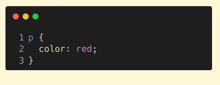
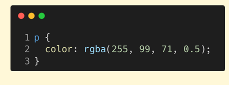
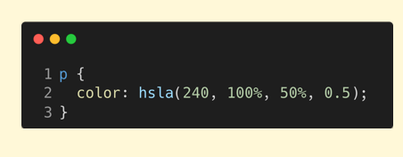
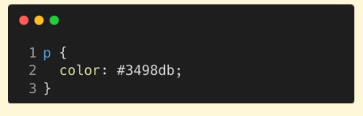

# Ways To Define Colors  
1. Color Names = CSS color names are predefined names like "red," "blue," or "green" for specific colors.  
2. RGB = RGB is a color model that combines red, green, and blue light in varying intensities to create colors.  
3. HSL = HSL is a color model representing hue, saturation, and lightness, used in CSS for more intuitive color manipulation.  
4. Hex Codes = HEX codes are six-digit codes (e.g., #RRGGBB) used in CSS to represent colors based on red, green, and blue values.  

## 1. Understanding Color Names  
  - <b>Predefined Color Names:</b> CSS provides a list of over 140 predefined color names, such as red, blue, green, black, white, etc. These color names are standardized and can be used directly in CSS without needing hex, RGB, or HSL values.  
  - <b>Easy to Use:</B> Color names are intuitive and easy to remember, making them a quick option for basic styling needs. However, they provide less flexibility compared to other color models (like HEX or RGB).
    

## 2. Understanding RGBA  
  - <b>RGBA Format:</b> RGBA stands for Red, Green, Blue, and Alpha. It extends the basic RGB color model by adding an alpha channel to control transparency. 
  - <b>Color Representation:</b> In RGBA, the first three parameters represent the red, green, and blue values, each ranging from 0 to 255, just like in RGB. 
  - <b>Alpha Channel (Transparency):</b> The fourth parameter, alpha, controls the transparency level of the color. The value ranges from 0 to 1, where:  
    - 0 means completely transparent. 
    - 1 means fully opaque.  

      

## 3. Understanding HSLA  
  - <b>HSLA Format:</b> HSLA stands for Hue, Saturation, Lightness, and Alpha. It extends the HSL model by adding an alpha channel for transparency control. 
  - <b>Hue (H):</b> Hue defines the color itself and ranges from 0 to 360 degrees, with key values like: 0° = Red 120° = Green 240° = Blue 
  - <b>Saturation (S):</b> Saturation specifies the intensity of the color, ranging from 0% (gray) to 100% (full color). 
  - <b>Lightness (L):</b> Lightness controls the brightness, ranging from 0% (black) to 100% (white), with 50% representing normal color brightness. 
  - <b>Alpha (A):</b> The alpha value controls transparency, with a range from 0 (fully transparent) to 1 (fully opaque).  
    

  ## 4. Understanding HEX Codes  
  - <b>HEX Code Format:</b> HEX codes represent colors using a hexadecimal (base-16) system. The format is #RRGGBB, where RR, GG, and BB are two-digit hexadecimal values for Red, Green, and Blue.  
  - <b>Color Representation:</b> Each pair of digits represents the intensity of red, green, and blue, ranging from 00 (no color) to FF (full intensity). For example, #FF0000 represents pure red.
  - <b>Advantages of HEX Codes:</b> HEX codes are widely supported across web technologies and offer precise control over colors.  
  
