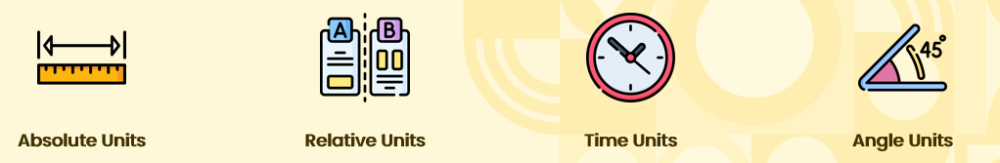
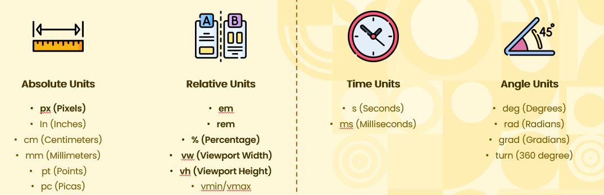
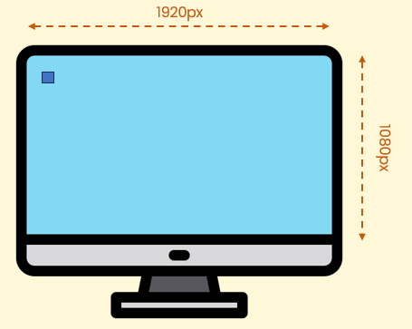
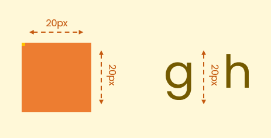
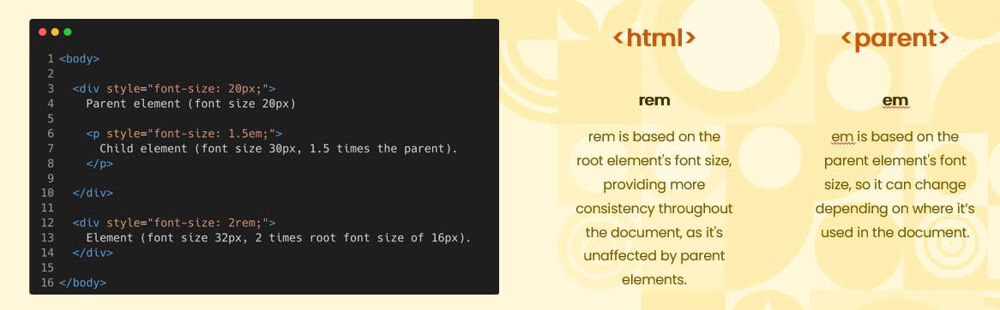
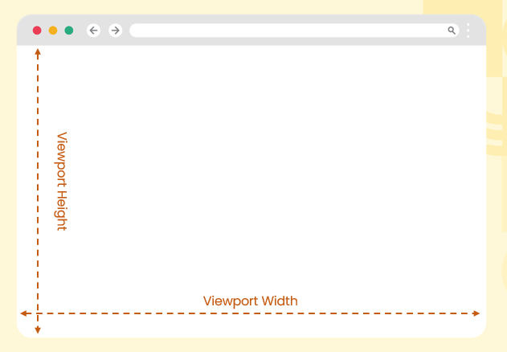

# Common Units of Measurement  
## CSS Has Four Types Of Units  
1. Absolute Units = These units have fixed values and don’t depend on other factors like screen size.
2. Relative Units = These units are based on the size of other elements or properties, allowing for more flexible layouts.
3. Time Units = Time units in CSS (s, ms) are used to control animation and transition durations.
4. Angle Units = Control the angle of an element and used to define rotations in transformations.

      

## Units Of Measurement
  * Absolute units and Relative Units. 

      

## What is a Pixel?  
  * Pixels (px) are the smallest unit of measurement in digital displays, representing a single point of light. In CSS, pixels are used to define fixed dimensions, unaffected by screen size or resolution changes.

      

## How it Translates to HTML Elements?  
  * With Fonts px refers to the height of the text from the bottom of the lowest descender (like in "g" or "y") to the top of the tallest ascender (like in "l" or "h"). The actual width and height of each character can vary depending on the font and its design.

      

## Why to Avoid Using Absolute Units  
  * <b>Lack of Responsiveness:</b> Absolute units don’t adapt to different screen sizes.  
  * <b>Inconsistent Display:</b> Elements may look different across devices (e.g., monitors vs. phones). 
  * <b>Poor Accessibility:</b> Fixed sizes can make content hard to read on smaller or larger screens.  
  * <b>Less Flexibility:</b> Absolute units lock layouts into specific dimensions, reducing scalability.  

## Understanding Relative Units  
  * rem = rem is based on the root element's font size, providing more consistency throughout the document, as it's unaffected by parent elements.
  * em = em is based on the parent element's font size, so it can change depending on where it’s used in the document.

      

  * Viewport Height (vh) = 1vh equals 1% of the viewport's height (the height of the browser window).
  * Viewport Width (vw) = 1vw equals 1% of the viewport's width (the width of the browser window).

      

  
  