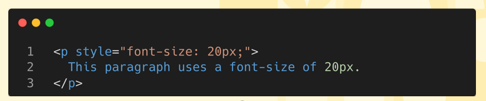
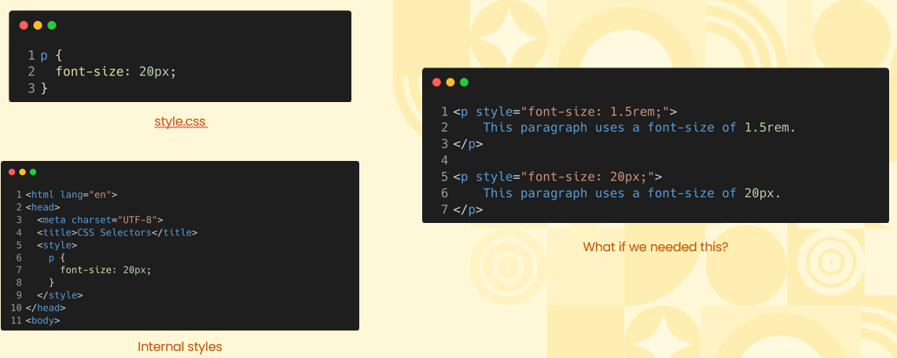

# Overview of CSS Selectors  
## Inline Style is Limiting  
* Inline styles in CSS are limiting because they apply styles directly to individual elements, making it difficult to maintain, update, and reuse across multiple pages. This approach leads to repetitive code and reduces flexibility in managing larger projects efficiently.
  

## Element Selectors are Not Efficient  
  

    
