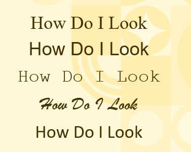
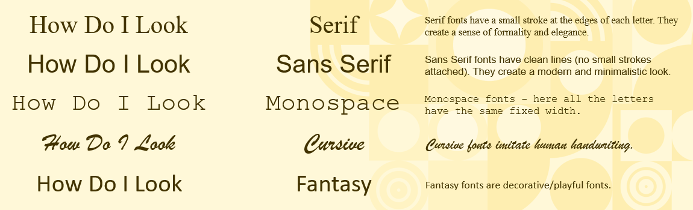
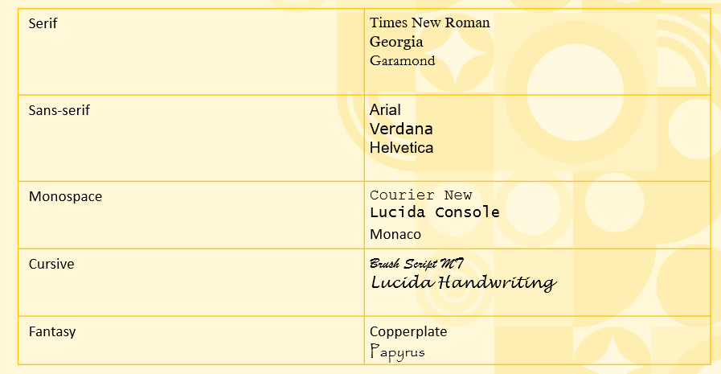
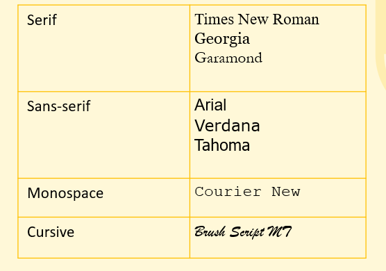
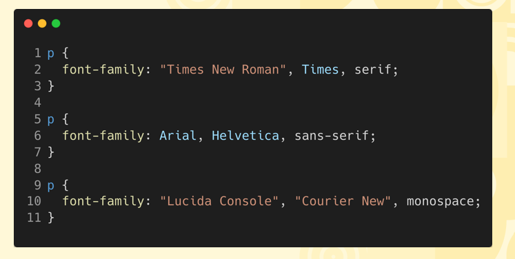
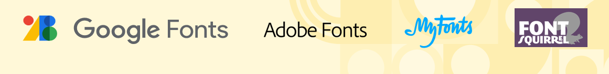

# Understandin Fonts  

## What is a Font?  
- A font is a specific style and design of text characters, including variations in size, weight, and appearance, used to display text in digital or printed formats.  

    

## CSS Has Five Generic Font Families  
  - <b>Serif</b> = Serif fonts have a small stroke at the edges of each letter. They create a sense of formality and elegance.
  - <b>Sans Serif</b> = Sans Serif fonts have clean lines (no small strokes attached). They create a modern and minimalistic look.
  - <b>Monospace</b> = Monospace fonts - here all the letters have the same fixed width.
  - <b>Cursive</b> = Cursive fonts imitate human handwriting.
  - <b>Fantasy</b> = Fantasy fonts are decorative/playful fonts.  

      

## Fonts In Various Font Families  
  

## The Browser Had No Fonts!  
  - <b>System Fonts:</b> Local fonts are installed directly on the user’s operating system and are accessed by the browser to render text if specified in the CSS.
  - <b>Web Fonts:</b> Web fonts are hosted online and loaded by the browser over the internet, allowing websites to display fonts not installed on the user’s system.  

## Are There Web Safe Fonts?  
  - Web safe fonts are a set of fonts that are universally installed on most operating systems and devices, ensuring consistent display across different browsers without relying on web fonts. Examples include Arial, Times New Roman, and Verdana.  

      

## Introducing a Font Family  
  - A font family is a group of fonts listed in order of preference, ensuring fallback options if the primary font isn’t available. It improves consistency across devices. The sequence starts with specific fonts (e.g., Arial), followed by generic families (e.g., sans-serif).
  - If the font name has more than one word, then it should be incorporated inside double quotations such as <mark>"Times New Roman".</mark>  

      

## What Are Web Fonts?  
  - Web fonts are fonts loaded from external servers rather than the user's system. When a webpage is accessed, the browser downloads the font from a specified URL, ensuring consistent text appearance across devices, even if the font isn't installed on the user's system.

      
  
  
