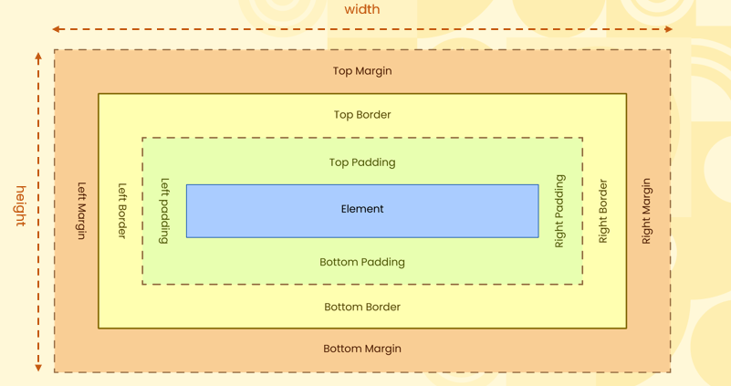
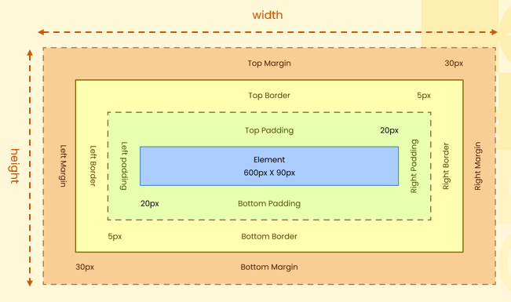
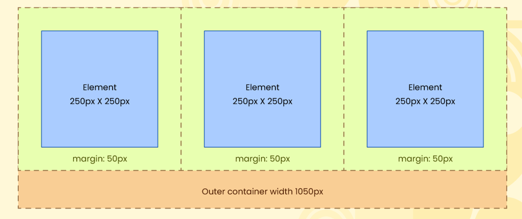
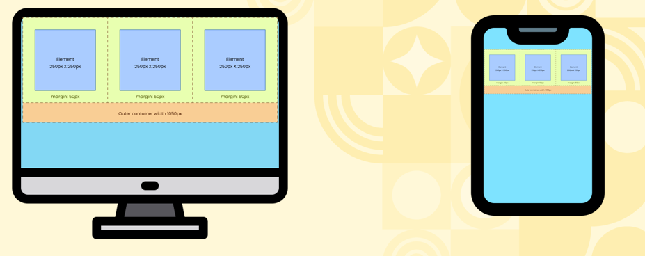
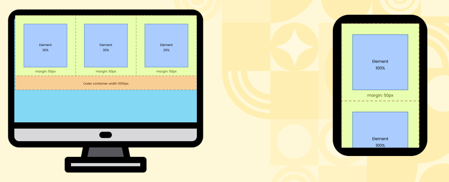

# Introduction To The Box Model  

## What is The Box Model?  
  * The box model in CSS defines the layout of elements, consisting of four parts: content, padding, border, and margin. 
  * These layers determine how elements are sized and spaced, affecting the overall design and layout on the webpage.

      

## How Are Dimensions Calculated?  
  * Total Width Calculation
      - `600px (width of content area)` 
      - `+ 40px (left padding + right padding)` 
      - `+ 10px (left border + right border) `  
      `= 650px (total width)`
    - Margin is outside of the element width and hence not added  

   * Total height Calculation    
      - `90px (width of content area) ` 
      - `40px (top padding + bottom padding) ` 
      - `10px (top border + bottom border)  `  
      `= 140px (total height)`  
      - Margin is outside of the element height and hence not added.  

       

  ## Margins Impact Outer Containers  

    
  - `Total Container Width = 1050px  `
  - `(-) 3 Elements Width 250px Each = 750px`  
  - `(-) 3 Elements Margin 100px each = 300px ` 
  - `Total = 0px `  

  ## Absolute Measurements Become Problematic  
  - Absolute measurements, like pixels, can create issues when designing layouts for multiple devices with different screen sizes and resolutions. 
  - Since they are fixed values, elements won't adjust or scale according to the device. 
  - This can cause layouts to appear too large or too small on different screens, reducing flexibility and responsiveness.  

      

  ## Relative Measurements Are Used  
  - This is why relative units like percentages are preferred over absolute units like pixels, as they allow elements to adjust and scale dynamically across different screen sizes, ensuring better responsiveness and flexibility in layouts.  

      

  
  
  

    
    
   