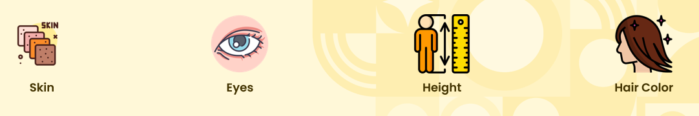
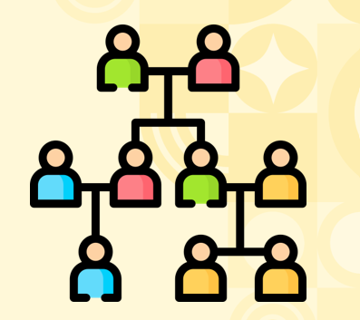
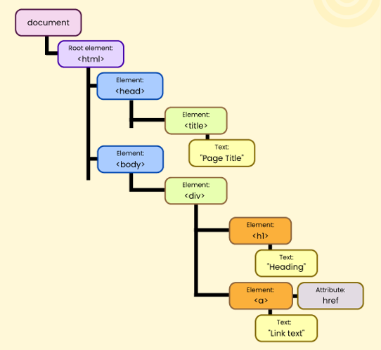
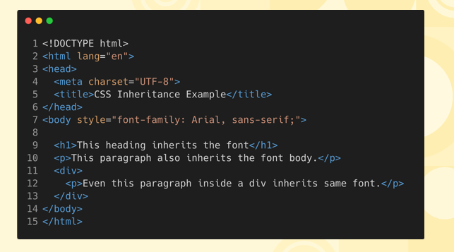

# Understandin Inheritance In CSS  

## Genetic Inheritance In Humans  
* Inheritance in humans refers to the passing down of genetic traits from ancestors to descendants through genes. These traits, such as eye color, hair type, and height, are encoded in DNA and are inherited from parents, grandparents, and earlier generations, influencing physical characteristics and sometimes health conditions in each individual.

    

## We Inherit Traits From Ancestors  
* Genetic inheritance refers to the process by which we receive traits from our parents or ancestors. This happens through genes passed down in DNA, which carry characteristics like eye color, hair type, and certain health conditions, making each of us a unique combination of our family's genetic history.

    

## HTML Elements Inherit CSS Properties  
* Just like humans inherit traits from their parents and ancestors, HTML elements can inherit certain CSS properties from their parent elements. When a parent element is styled, child elements automatically inherit these styles unless specified otherwise, creating a consistent and unified design across the webpage, similar to how inherited traits define family characteristics.

    

## Inheritance Reduces Repetitive Effort  
* Just like humans inherit traits from their parents and ancestors, HTML elements can inherit certain CSS properties from their parent elements. When a parent element is styled, child elements automatically inherit these styles unless specified otherwise, creating a consistent and unified design across the webpage, similar to how inherited traits define family characteristics.

    

## Properties Which Are NOT Inherited  
1. <b>Margins, Padding</b> = Layout and box-model-related properties are not inherited because each element's layout is usually independent.
2. <b>Background, Border</b> = Borders and background properties are not inherited by default; they must be explicitly applied to child elements.
3. <b>Browser Defaults</b> = Borders and background properties are not inherited by default; they must be explicitly applied to child elements.
