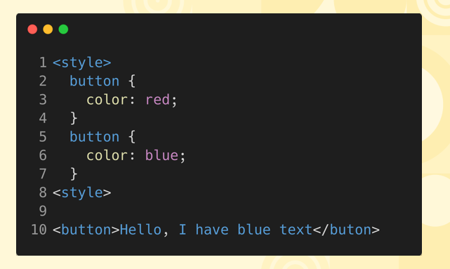
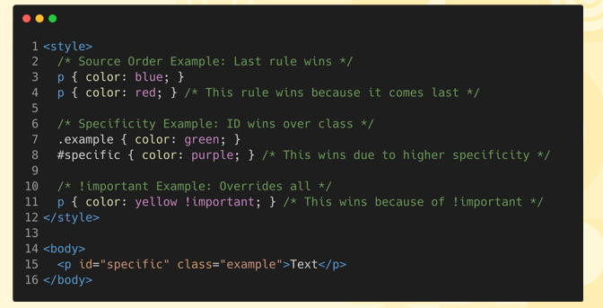

# Understanding The Cascade  

## What is The Cascade?  
* The CSS cascade is the process by which the browser decides which CSS rules to apply when multiple rules target the same element. It considers rule importance, specificity, and source order to resolve conflicts and determine the final styles applied. It's the reason that the text of the button styled with the following CSS will be red.

    

## The Cascade’s Key Concepts  
* <b>Source Order:</b> Source order in CSS refers to the order in which styles are written in the stylesheet. When specificity and importance are equal, the last rule written takes precedence.

* <b>Specificity:</b> Specificity in CSS is a ranking system that determines which rule takes precedence when multiple rules target the same element, based on the type of selectors (IDs, classes, elements) used.

* <b>Importance:</b> The !important in CSS overrides normal specificity rules, ensuring that the specified style takes priority over other conflicting styles, regardless of their specificity or order in the stylesheet.

  