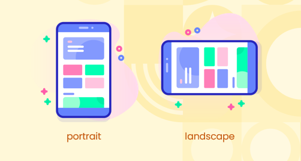
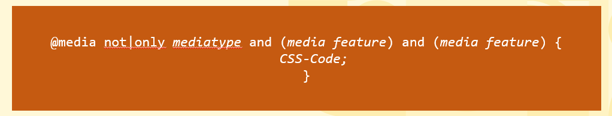
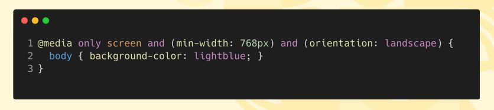
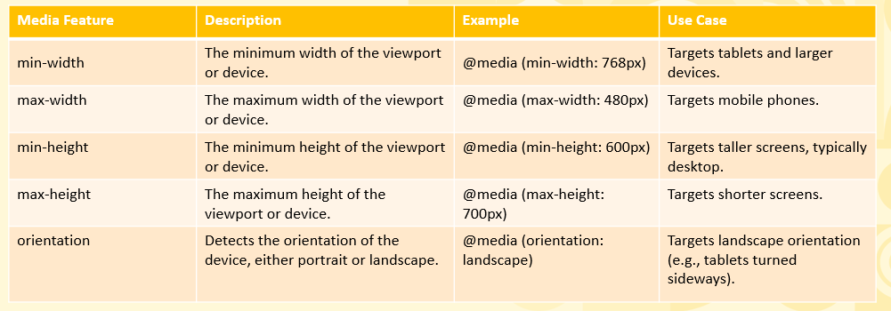
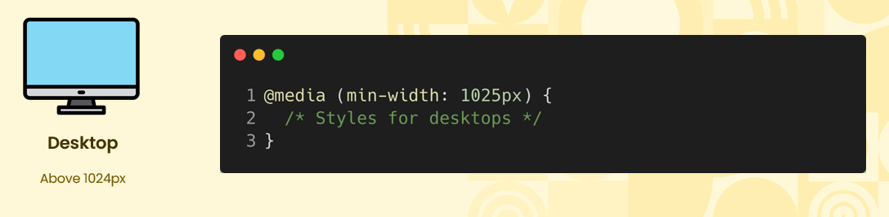
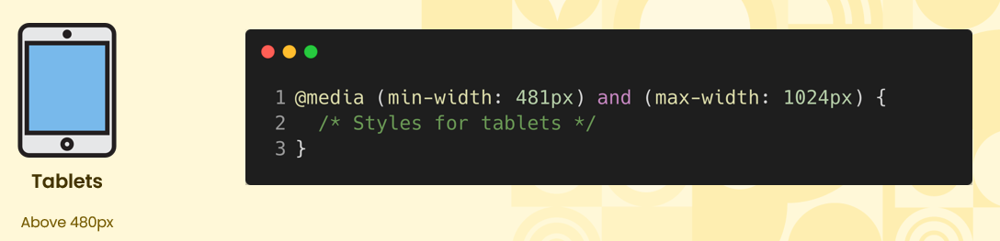
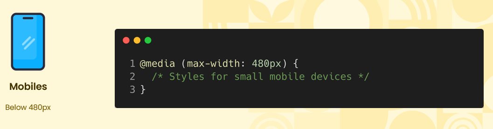
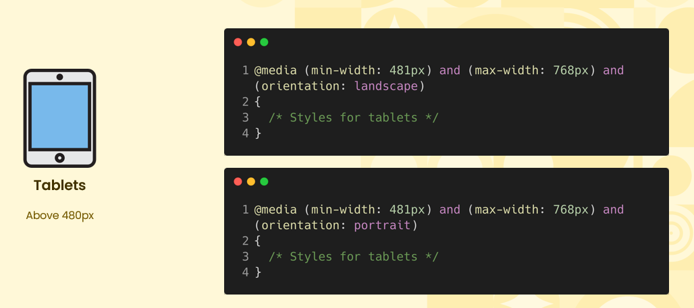

# What is Responsive Web Design  

## Responsive Web Design
* Responsive web design is an approach to building websites that adapt and adjust their layout, images, and content seamlessly across different screen sizes and devices, ensuring an optimal user experience on desktops, tablets, and mobile devices.

## What is Device Orientation?  
* Orientation in CSS refers to the screen's display mode, either portrait (taller than wide) or landscape (wider than tall). It helps apply styles based on how a device is rotated or positioned.

    

## Introducing Media Queries  
    

* Media Query Syntax :
    - <b>@media:</b> Starts the media query, signaling the browser to apply conditional styles.
    - <b>not|only:</b>   
          - only: Applies the styles exclusively to a specific media type.  
          - not: Negates the query, applying styles if the media type or feature is not met.
    - <b>mediatype:</b> Specifies the type of device, such as screen, print, or speech.
    - <b>and:</b> Combines multiple conditions or features.
    - <b>(media feature):</b> Defines device characteristics, like min-width, max-width, orientation, etc.  
  
    

## Common Media Features  

    

## Media Query For Device Types  
* Desktop Media Query 

    

* Tablet Media Query  

    

* Mobile Media Query  

    

* Tablet Media Query with Orientation 

  
