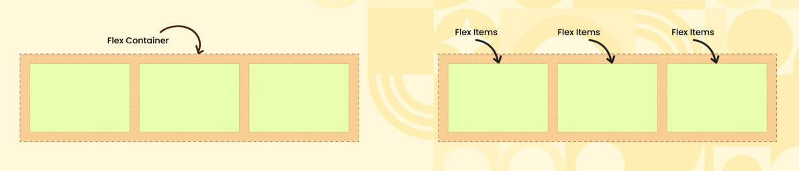
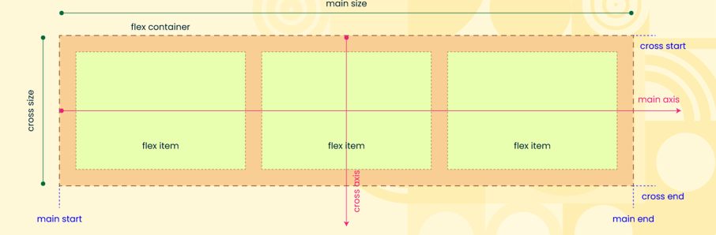
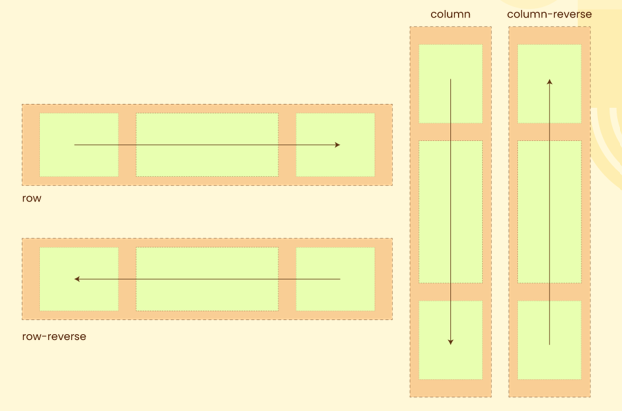
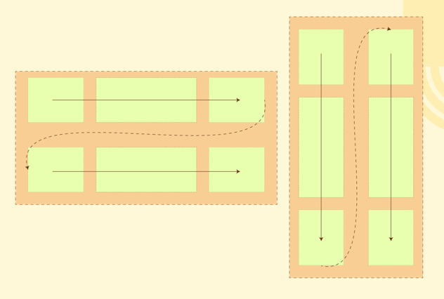
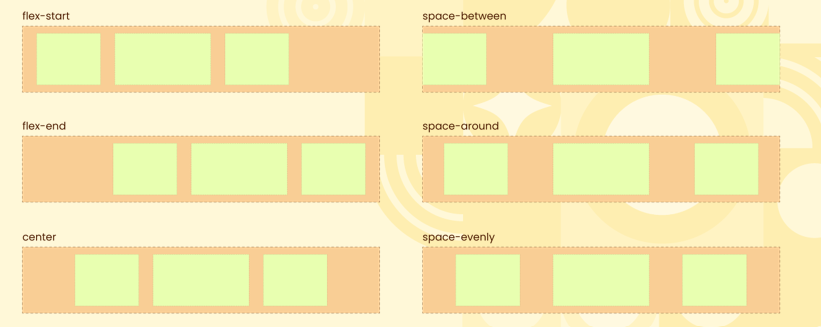
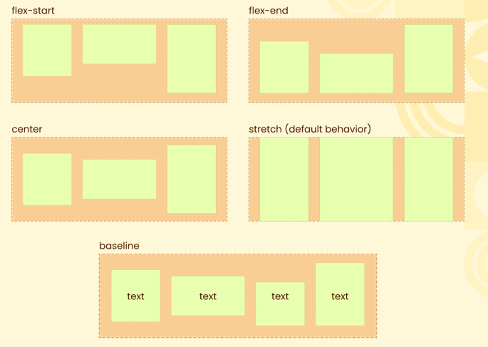
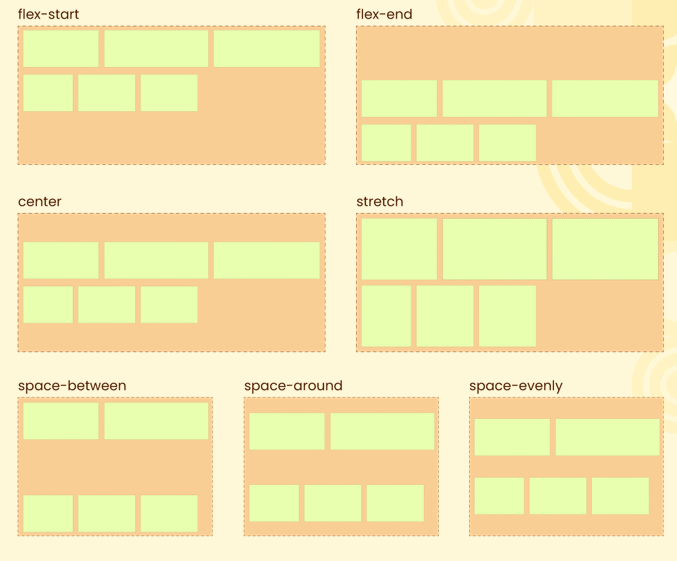
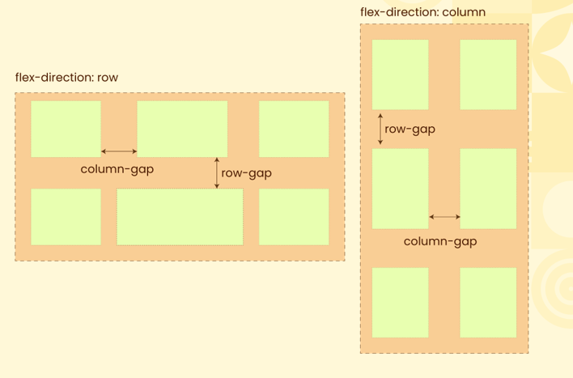

# Introduction To Flexbox  

## Evaluating Floats Vs. Flexbox  
### Floats  
- <b>Complex:</b> Requires clearfixes and extra elements for layout. 

- <b>Alignment Issues:</b> Hard to align items vertically. 

- <b>Unpredictable Behavior:</b> Floats disrupt normal document flow. 

- <b>Lacks Flexibility:</b> Not ideal for responsive design. 

- <b>Maintenance:</b> Requires extra workarounds like clearing floats.  

### Flexbox
- <b>Simpler:</b> No need for clearfixes or extra elements. 

- <b>Easy Alignment:</b> Built-in vertical and horizontal alignment. 

- <b>Predictable:</b> Items stay in normal flow. 

- <b>Responsive:</b> Flexbox adapts easily to screen size. 

- <b>Low Maintenance:</b> No workarounds required for layout control.  

## Flexbox Parent and Children  
* Flex Container = A flex container is the parent element with display: flex or display: inline-flex, allowing its child elements (flex items) to be arranged dynamically.
* Flex Items = Flex items are the direct child elements of a flex container, which can be aligned, resized, and arranged along the main and cross axes based on flexbox properties.

    

## Basics of Using Flexbox  
* <b>Main Axis:</b> The main axis is the primary axis along which flex items are arranged, determined by the flex-direction property (horizontal or vertical). 
* <b>Main-Start | Main-End:</b> Flex items are placed starting from the main-start and proceed towards the main-end of the container. 
* <b>Main Size:</b> A flex item's main size refers to its width or height, depending on the main axis (defined by the flex-direction property).  
* <b>Cross Axis:</b> The cross axis is perpendicular to the main axis, and its direction is determined by the main axis. 
* <b>Cross-Start | Cross-End:</b> Flex items are placed starting at the cross-start and flow towards the cross-end of the container. 
* <b>Cross Size:</b> A flex item's cross size refers to its width or height, depending on the cross axis, opposite the main axis.  

    

## Understanding Flex Direction  
* Defines Main Axis: The flex-direction property sets the direction in which flex items are laid out. 
* Possible Values: 
    - <b>row:</b> Aligns items horizontally (left to right). 
    - <b>row-reverse:</b> Horizontally (right to left). 
    - <b>column:</b> Aligns items vertically (top to bottom). 
    - <b>column-reverse:</b> Vertically (bottom to top). 
* Affects Main and Cross Axes: Changes the main axis and alters how flex items are aligned. 
* Default: The default value is row, where items align from left to right.  

    

## Wapping Content flex-wrap  
* The flex-wrap property controls whether the flex items should wrap onto multiple lines or columns when there isn't enough space inside the container.
    - Use <b>flex-wrap:</b> wrap to allow items to flow into the next line or column when there's not enough space. 
    - Use <b>wrap-reverse</b> for layouts that require reversed wrapping, such as content stacking from bottom to top or right to left.  
  
    

## Distribute Space With justify-content 
  * ### Justify Content works along the main-axis of flex-box 
  
    

* <b>flex-start (default):</b> Items are aligned to the start of the flex container. Alternate name: start (not widely supported). 
* <b>flex-end:</b> Items are aligned to the end of the flex container. Alternate name: end (not widely supported). 
* <b>center:</b> Items are centered along the main axis.  
* <b>space-between:</b> Items are evenly distributed; the first item is aligned to the start, the last item is aligned to the end, with equal space between items. 
* <b>space-around:</b> Items are evenly distributed, with space before the first item and after the last item. 
* <b>space-evenly:</b> Items are evenly distributed with equal space around each item. Newer value, not supported in older browsers.

## Align-items Along Vertical Axis  
  * ### The align-items property aligns flex items along the cross axis (vertical axis when the flex direction is row).
  
    

* <b>stretch (default):</b> Items stretch to fill the container along the cross axis. 
* <b>flex-start:</b> Items are aligned to the start of the cross axis (top). Alternate name: start (not widely supported). 
* <b>flex-end:</b> Items are aligned to the end of the cross axis (bottom). Alternate name: end (not widely supported). 
* <b>center:</b> Items are centered along the cross axis. 
baseline: Items are aligned based on their text baseline.  

## Distribute Content Vertically align-content  
  * ### This aligns a flex container’s lines within when there is extra space in the cross-axis, similar to how justify-content aligns individual items within the main-axis.
  
    

* <b>flex-start:</b> Aligns flex lines at the start of the container. 
* <b>flex-end:</b> Aligns flex lines at the end of the container. 
* <b>center:</b> Aligns flex lines at the center of the container. 
* <b>space-between:</b> Distributes flex lines evenly with the first line at the start and the last line at the end. 
* <b>space-around:</b> Distributes flex lines with equal space around them. 
* <b>space-evenly:</b> Distributes flex lines with equal space between and around them. 
* <b>stretch:</b> The flex lines will stretch to take up the remaining space in the container.  

## Add Gaps row-gap and column-gap  

    

* <b>row-gap:</b> Controls the vertical spacing between rows in a flex or grid container, along the cross axis. 

* <b>column-gap:</b> Defines the horizontal space between columns in a flex or grid container, along the main axis.

