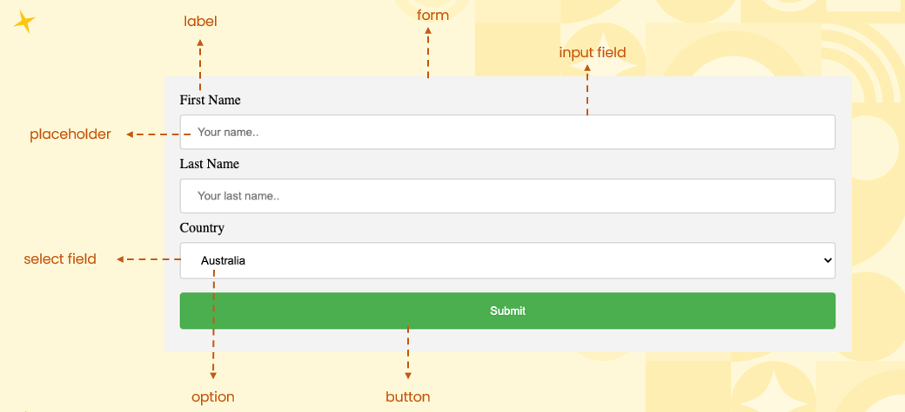
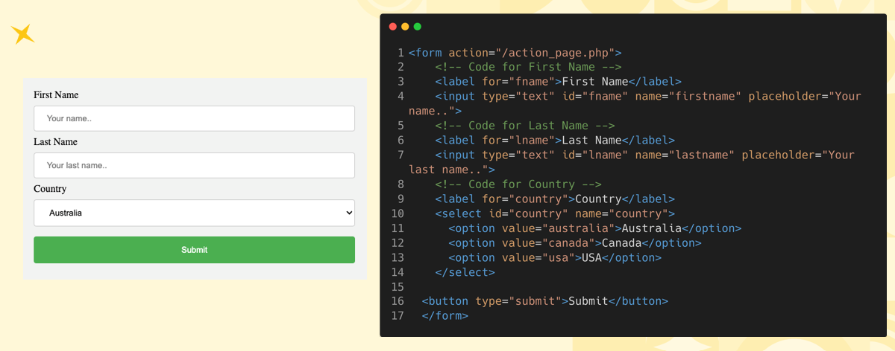
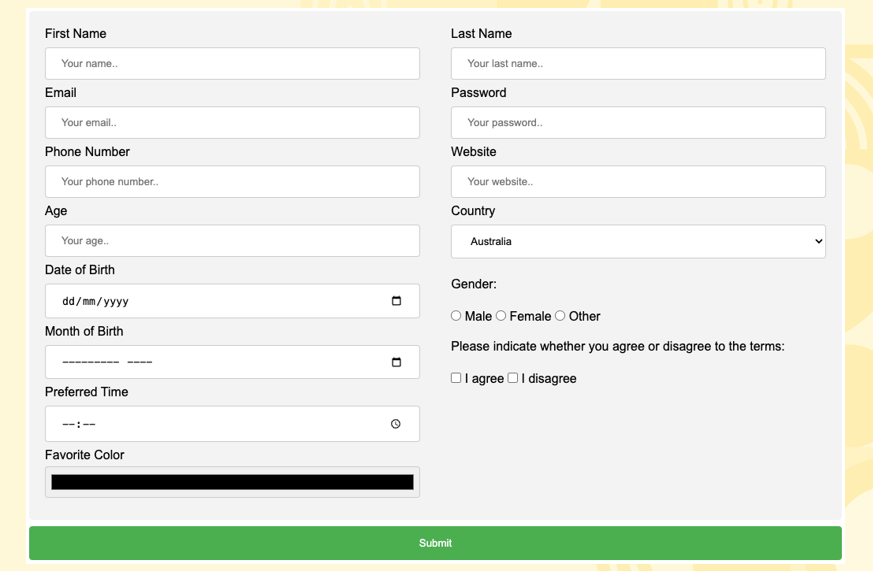
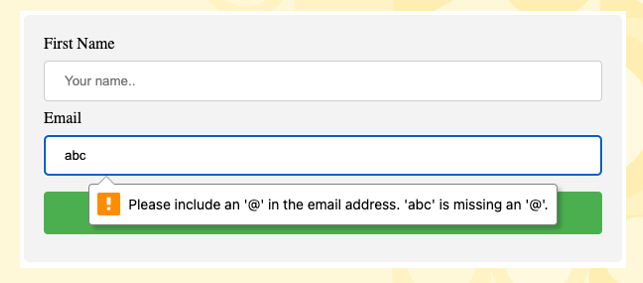

# Introduction To Forms  

## Elements Of A Form  
    

## Code Behind A Form  
    

## Types Of Fields  
    

## Getting Correct Inputs With Validations  
    

* <b>Simple Validations In HTML</b> = Validation is the process of ensuring that data entered into a system or form meets predefined requirements, rules, or constraints. It helps maintain data integrity by verifying that inputs are correct and acceptable before being processed or stored.
