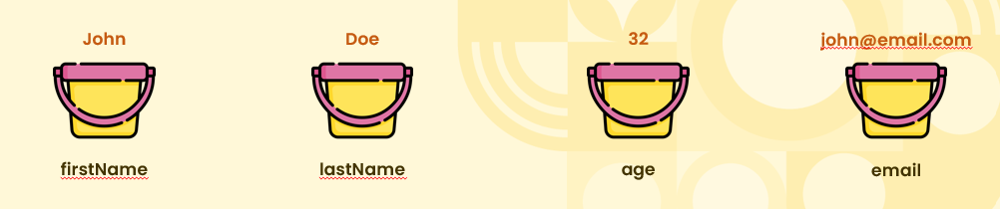
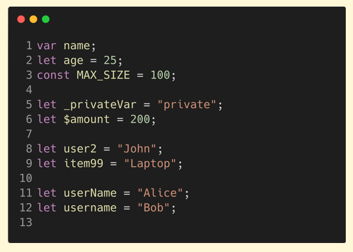
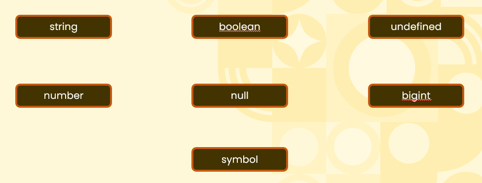
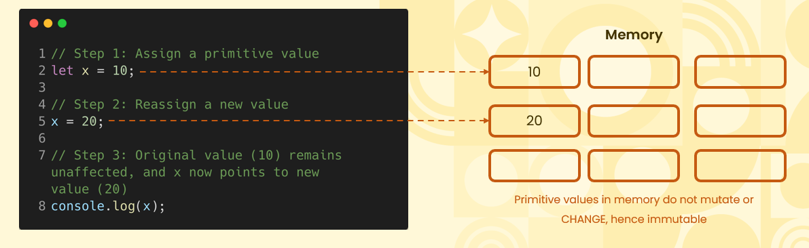

# Getting Started With Variables  

## What is a Variable  

  
* A variable in programming is a named container that stores data values. It can hold different types of information, such as numbers or text, and allows the program to manipulate this data dynamically.

## Rules for Naming a Variable  
* <b>Start with a letter, underscore (_), or dollar sign ($):</b> Variable names must not begin with a digit. Examples: myVar, _privateVar, $element. 

* <b>Subsequent characters can be letters, digits, underscores, or dollar signs:</b> After the first character, you can use letters, digits, underscores, and dollar signs. Example: var1, counter_1. 

* <b>Case-sensitive:</b> Variable names are case-sensitive, meaning myVar and myvar are different. 

* <b>Avoid reserved keywords:</b> You cannot use JavaScript keywords or reserved words as variable names (e.g., class, let, function).  

    

## Examples of Reserved Keywords  
* break, case, catch, class, const, continue 
* debugger, default, delete, do 
* else, enum, export, extends 
* false, finally, for, function if, implements, import, in, instanceof, interface
* let 
* new, null 
* package, private, protected, public 
* return 
* static, super, switch 
* this, throw, true, try, typeof 
* var, void 
* while, with yield  

## What are Data Types  
* <b>Date Types</b> = In programming, data types define the type of value a variable can hold. They specify how the data is stored and how operations on the data are performed.

## Introducing Primitive Data Types  
* <b>Primitive Types</b> = Primitive data types in JavaScript are the most basic types of data that are <b>immutable</b> and hold only a single value. These include Number, String, Boolean, Null, Undefined, Symbol, and BigInt. They cannot be modified directly, and operations on them result in new values rather than altering the original.

    

## Why are Primitives Immutable  
* <b>Primitive value assignment:</b> A variable is assigned a primitive value (e.g., a number, string, or boolean). 

* <b>Reassignment:</b> When a new value is assigned, a new space in memory is allocated, and the variable now points to this new value. 

* <b>Immutability:</b> The original value remains unchanged in memory, and operations on it return new values rather than modifying the original one. This makes primitives immutable.  

  

