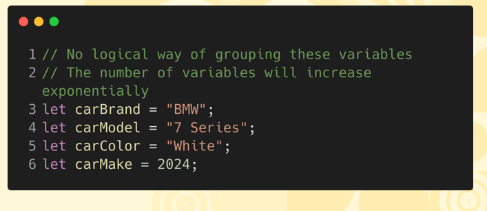
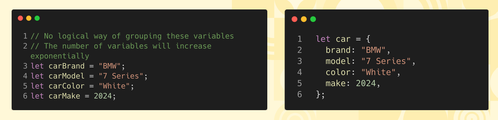
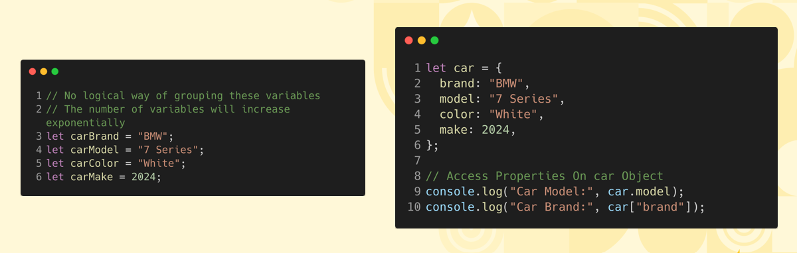
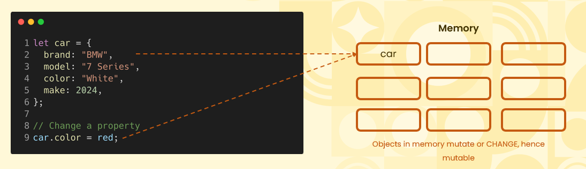
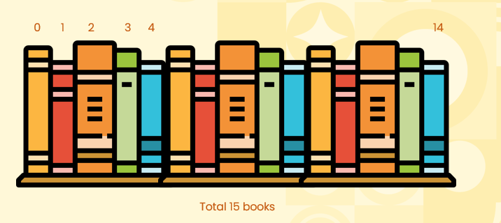
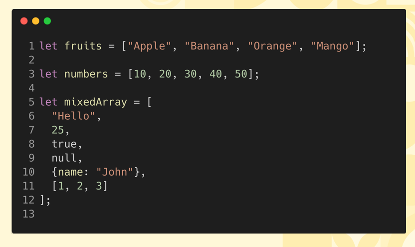

# Introduction to Objects  

## Problem Working With Variables  

      

## Objects Allow You to Group Properties  
    

     

## Objects and Mutability  
* <b>Object assignment:</b> When an object is assigned to a variable, the variable holds a reference to the memory location of that object. 

* <b>Property modification:</b> Changing a property of the object (e.g., car.color = "red";) modifies the existing object in memory, without creating a new object. 

* <b>Mutability:</b> Objects are mutable, meaning changes to properties directly affect the original object in memory, unlike primitive values, which are immutable.  

    

# Introduction to Arrays  

## An Example of an Array  
    

* Think of an array as a bookshelf with numbered slots, and each slot can hold one book (or value). Just like a bookshelf, the slots are in a specific order, starting from 0. You can place, replace, or remove a book from any slot.

## Syntax For Declaring Arrays  
    

