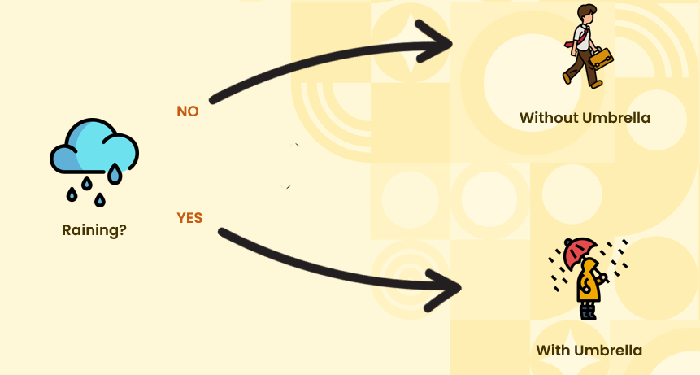
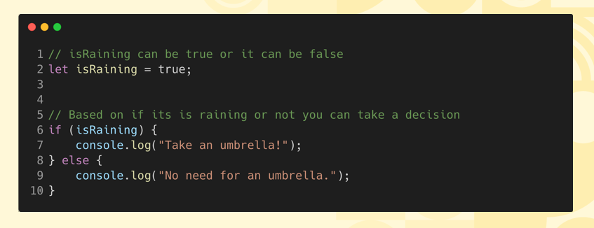

# Introduction to Conditional Statements  

## How We Take Decisions  
    

## Syntax For Conditional Statements  
<b>Is it raining? If yes, I'll take an umbrella. Otherwise, I won't.</b>

* This code checks if the isRaining variable is true. If it is, it advises taking an umbrella. If not, it suggests you don't need one.

     

