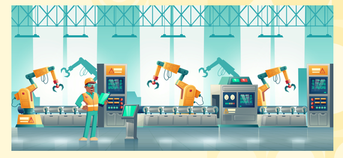

# Introduction to Loops  

## Real World Example of Loops  

* <b>What are loops?</b>
  - Imagine a conveyor belt in a candy factory. Your job is to place a sticker on each piece of candy. Instead of sticking each piece manually, the conveyor belt repeats the process for you, doing the same task for every candy that passes by. Similarly, in programming, loops repeat a block of code over and over, until a specific condition is met, automating repetitive tasks efficiently, just like the conveyor belt handles each candy. This is how loops save time and effort when performing repetitive operations in code.  

   
  