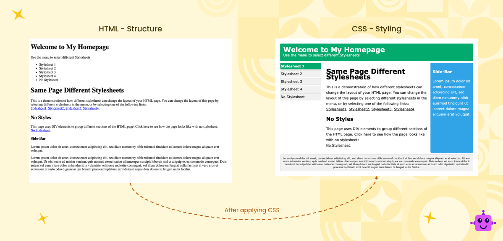
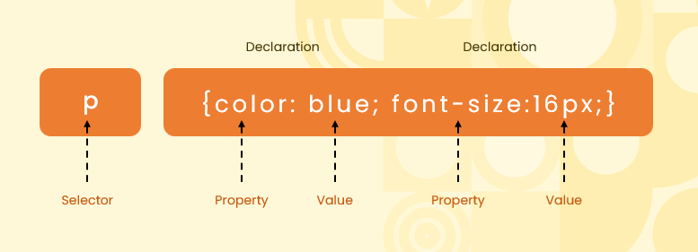
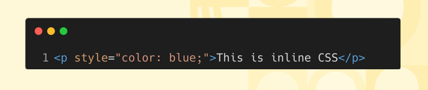
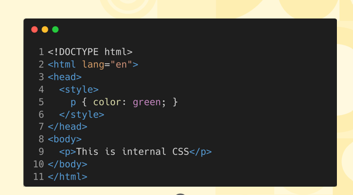
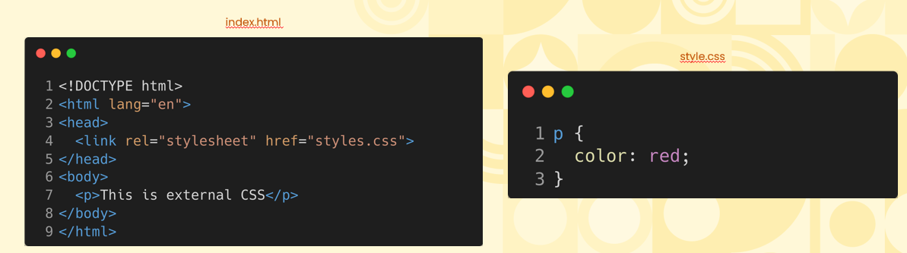

#  Cascading Style Sheet  
* CSS (Cascading Style Sheets) is a language used to style and layout web pages. It controls the design, including colors, fonts, spacing, and positioning, to enhance the appearance of HTML elements across different devices and screen sizes.

## Example Of What CSS Does  

## Basic Syntax of CSS  
  

## Where Can CSS Be Declared?  
### Inline CSS  
  - Inline styles are applied directly to HTML elements using the style attribute. They are useful for quick, specific styling but aren't scalable for larger projects  
    

### Internal Styles  
  - Internal styles are declared inside a `<style>` tag within the HTML document's `<head>`. They affect only the elements on that specific page.
    

### External Stylesheet  
  - External stylesheets are separate .css files linked to HTML documents. They allow for consistent styling across multiple pages and are ideal for larger, scalable projects.
    

# Difference In Scope Of Impact  
1. Inline Style - Affects only the individual element it is applied to, with the highest specificity in overriding other styles.  

2. Internal Styles - Affects all elements on the same page, but cannot be reused across multiple pages.  

3. External Stylesheets - Affects all linked pages, providing consistent styling and easy maintenance for larger projects across a website. 